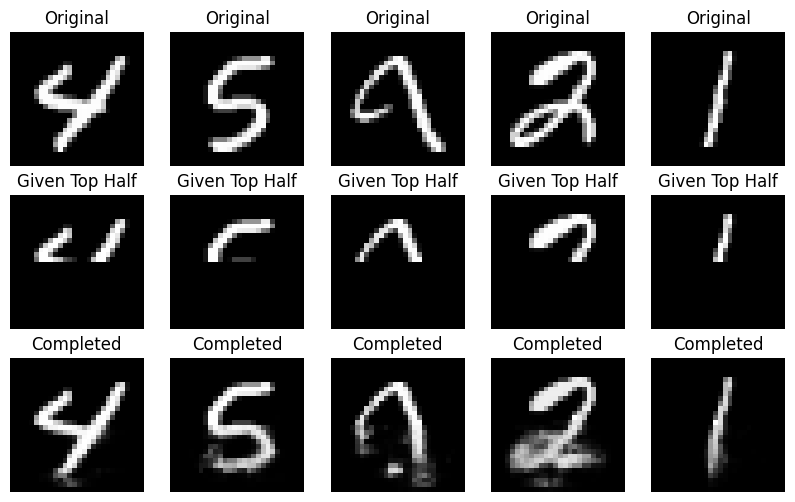
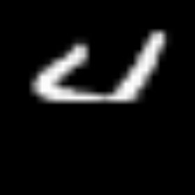
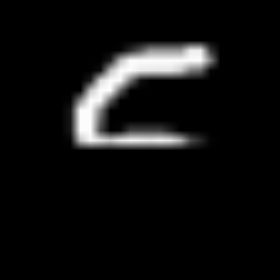
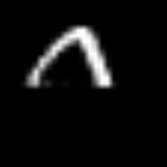
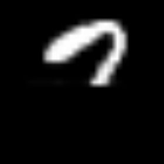

# PixelCNN Image Completion

This repository contains an implementation of PixelCNN for image generation, specifically for completing images given the top half as input. The model follows an autoregressive approach to generate the missing pixels while maintaining Auto-regressiveness property i.e, Maked convolutions.

## Model Predictions

Here is an example of images generated by PixelCNN:

  

## Overview

PixelCNN is a deep learning model designed for image generation based on conditional probabilities. It is particularly useful for inpainting and structured image completion tasks.

## Features

- Implements PixelCNN with masked convolutions.
- The Code is trained on MNIST dataset but can be altered to any other just check the dimensions.
- The models was trained on 200 epochs (took about 1.5 hours on RTX2060).
- Uses autoregressive modeling for high-quality completions.
- Includes animation of the generation process.

## Generation Animation

  
  
  
  
